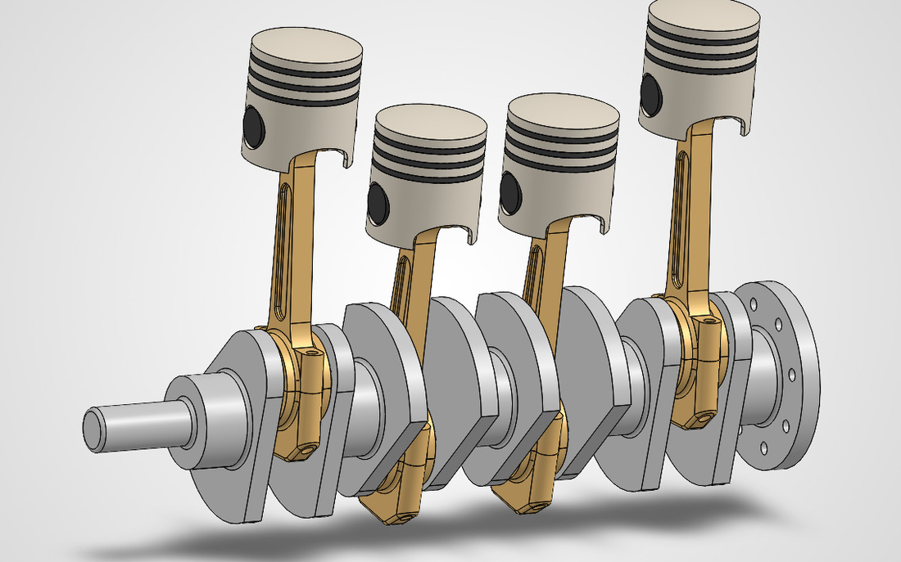
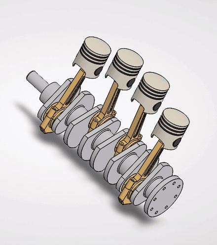
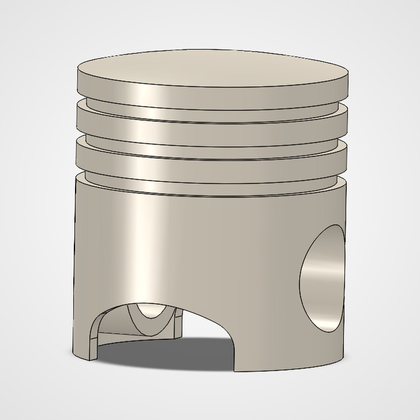
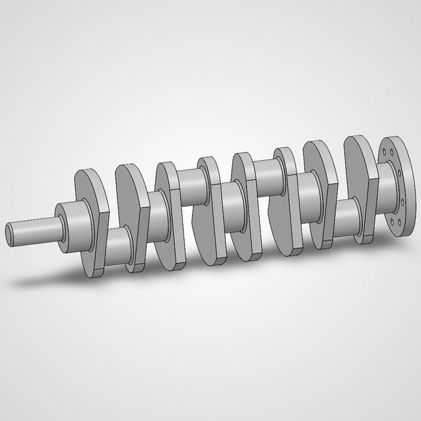
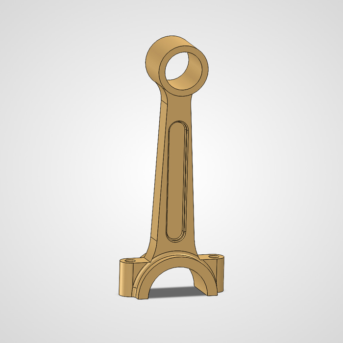

# Four-Cylinder Rotating Assembly — SolidWorks

A four-cylinder engine rotating assembly modeled from scratch in SolidWorks: every
component built as an individual part, then mated into an assembly where crankshaft
rotation drives all four pistons through the connecting rods.



## Motion study

Crankshaft rotation drives the four piston/rod pairs through the crank-slider linkage.
The pistons reach top dead center in the crankshaft's firing sequence rather than
moving together, which is what the offset crank throws produce.



## Components

| # | Part | Notes |
|---|------|-------|
| 01 | Piston | Ring grooves and wrist-pin bore |
| 02 | Piston ring | Modeled separately and seated in the piston groove |
| 03 | Crankshaft | Four offset throws, counterweights, flanged output end |
| 04 | Connecting rod | I-beam shank, split big end |
| 05 | Rod cap | Bolted to the rod big end — split-bearing construction |
| 06 | Piston pin | Joins the piston to the small end of the rod |

<p align="center">
  
  
  
</p>

## What I worked through

- **Split big end.** The connecting rod and rod cap are separate parts mated at the
  big end rather than one solid piece, mirroring how a real rod bolts around the
  crank journal.
- **Mate scheme for motion.** The assembly is constrained so that it has one degree
  of freedom: turning the crankshaft moves everything else. Getting the rod ends
  constrained without over-defining the assembly was the main challenge.
- **Part reuse.** The piston, ring, rod, cap, and pin are each modeled once and
  instanced four times, so a change to a part propagates through the whole assembly.

## Scope

This is the **rotating assembly** — pistons, rings, pins, rods, caps, and crankshaft.
It does not include a cylinder block, head, or valvetrain.

## Files

```
parts/        individual .SLDPRT files
assembly/     the .SLDASM
images/       renders and motion study
```

Open `assembly/` in SolidWorks 2024 or later. GitHub cannot preview SolidWorks files
in the browser, so the renders above are the quickest way to see the model.

## Tools

SolidWorks — part modeling, assembly mates, motion study, rendering

---

Built by Adam Azzubaidi · Mechanical Engineering, Brooklyn College · [github.com/AdamA132](https://github.com/AdamA132)
